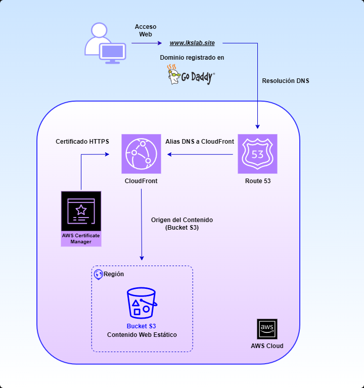
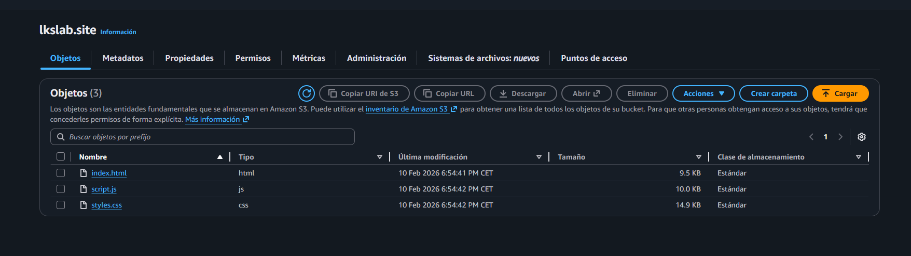
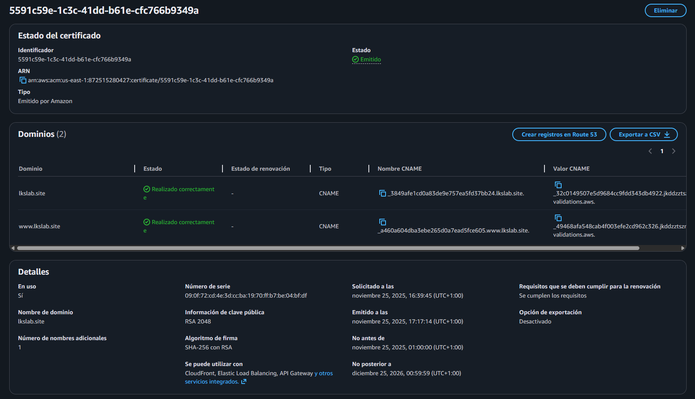
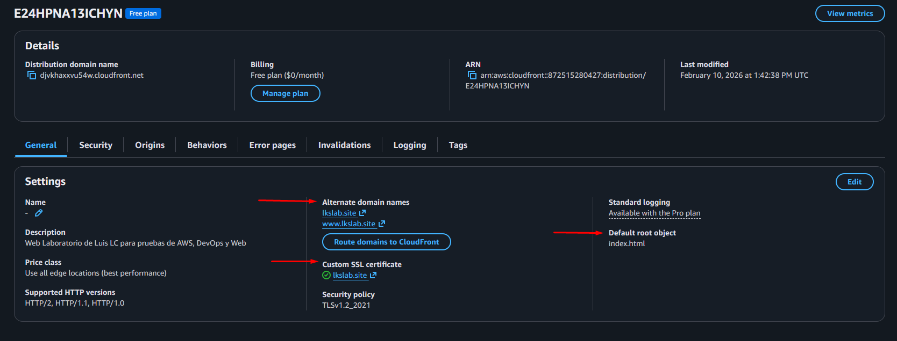
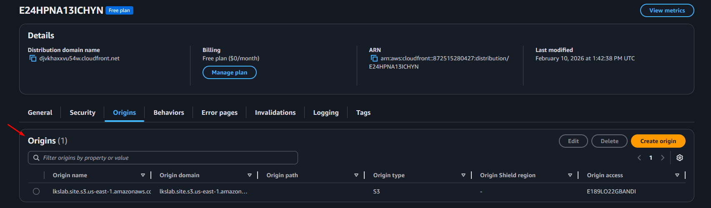
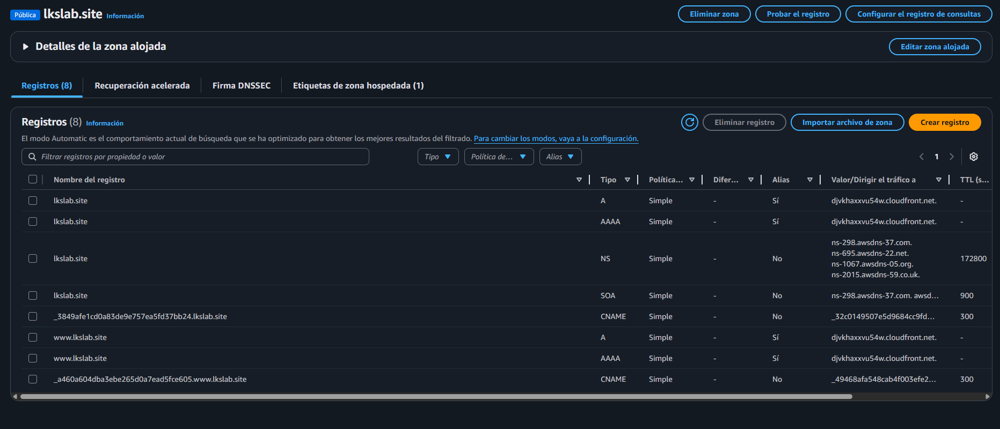
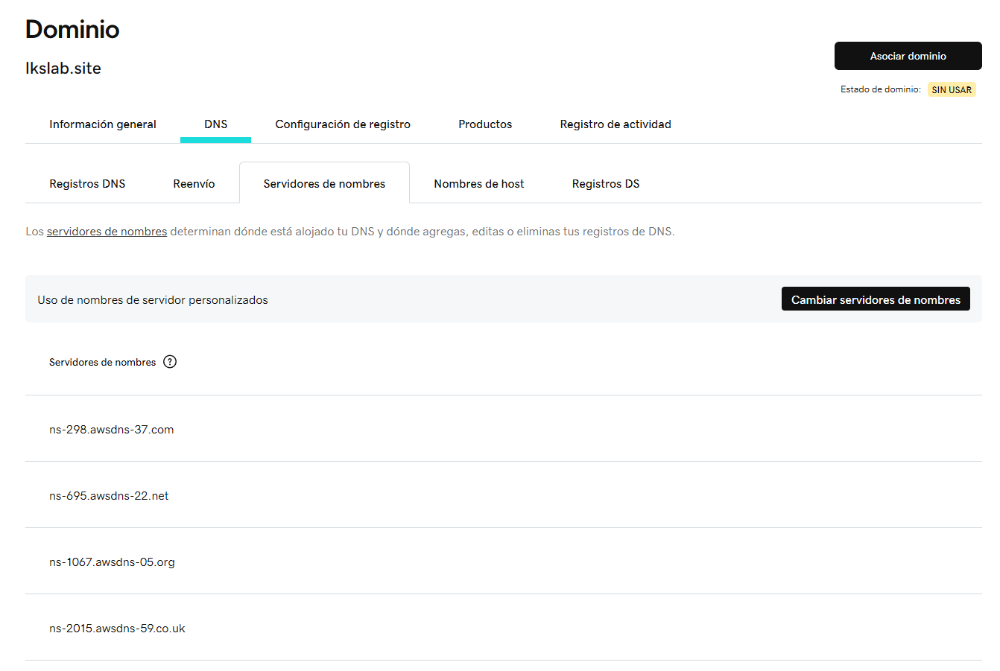
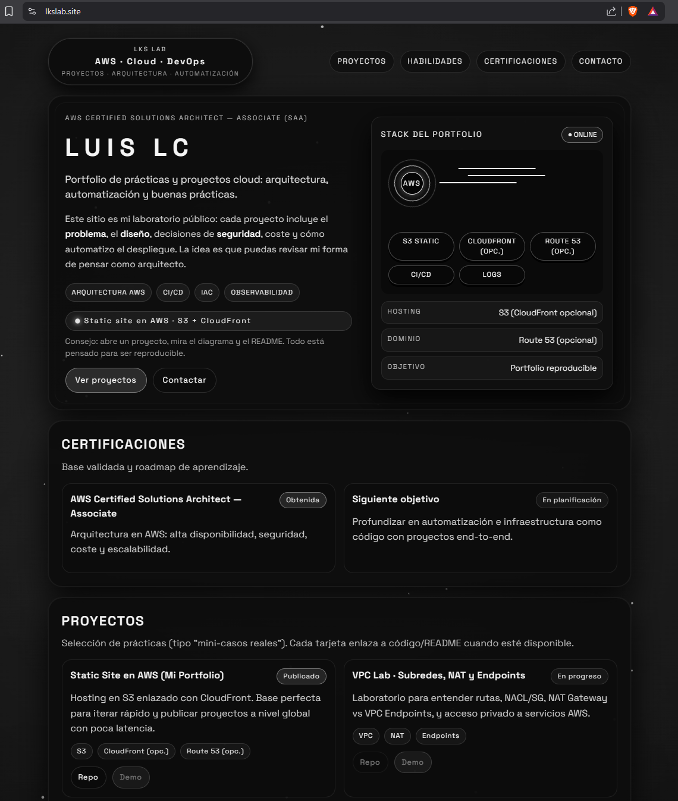

# AWS Static Website

---

  

---

## 📌 Resumen del Proyecto

Este repositorio recoge la documentación del despliegue y configuración de mi portfolio personal, desplegado mediante una arquitectura de hosting estático. El objetivo del proyecto ha sido poner en producción una web real para presentar mi perfil, mis proyectos y mi evolución en el área de Cloud y DevOps.

La solución se apoya en Amazon S3 para el almacenamiento del sitio, CloudFront para la distribución del contenido, AWS Certificate Manager (ACM) para la gestión del certificado HTTPS y Amazon Route 53 para la resolución DNS del dominio. Además, el dominio fue registrado inicialmente en GoDaddy y posteriormente delegado a Route 53 mediante el cambio de nameservers.

---

## 🎯 Objetivos

Este proyecto nace con la idea de publicar mi portfolio personal mediante una solución de hosting estático, utilizando una arquitectura sencilla, real y fácil de mantener. Más allá de servir como carta de presentación profesional, el objetivo principal ha sido convertir una web ya creada en un caso práctico de despliegue cloud.

A través de este proyecto he buscado trabajar varios puntos clave:

- Publicar una web estática en un entorno real.
- Entender cómo se integran Amazon S3, CloudFront, ACM y Route 53 en un despliegue de este tipo.
- Conectar un dominio personalizado registrado en GoDaddy con la infraestructura alojada en AWS.
- Practicar una arquitectura sin servidor enfocada al hosting y a la entrega del contenido.
- Documentar el proceso de forma clara para poder explicarlo y reutilizarlo como referencia en futuros proyectos.

---

## 🏗️ Arquitectura

### Descripción general

La solución utiliza una arquitectura de hosting estático apoyada en AWS para publicar el portfolio de forma segura y accesible mediante dominio personalizado. El contenido de la web se almacena en Amazon S3 y se distribuye a los usuarios a través de CloudFront, mientras que el certificado HTTPS se gestiona con AWS Certificate Manager (ACM). El dominio fue registrado inicialmente en GoDaddy y, tras delegar los nameservers, la resolución DNS pasó a gestionarse desde Amazon Route 53.

### Diagrama

El siguiente diagrama representa la arquitectura general utilizada para publicar el portfolio web, mostrando el flujo desde el acceso del usuario al dominio hasta la entrega del contenido estático alojado en Amazon S3 a través de CloudFront.

  

### Flujo funcional

1. El usuario accede al dominio personalizado desde el navegador.
2. Route 53 resuelve la consulta DNS del dominio.
3. Route 53 dirige la petición hacia la distribución de CloudFront.
4. CloudFront entrega el contenido desde caché si está disponible.
5. Si el contenido no está en caché, CloudFront lo obtiene desde el bucket de Amazon S3 configurado como origen.
6. El certificado gestionado con ACM permite servir la web mediante HTTPS.
7. Finalmente, el usuario accede al sitio de forma segura.

### Componentes principales

**Amazon S3**  
Se utiliza como almacenamiento del sitio web estático, alojando los archivos necesarios para la página, como HTML, CSS, JavaScript e imágenes.

**Amazon CloudFront**  
Actúa como red de distribución de contenido (CDN), permitiendo entregar la web de forma más eficiente y ofreciendo compatibilidad con HTTPS.

**AWS Certificate Manager (ACM)**  
Se encarga de emitir y gestionar el certificado SSL utilizado por CloudFront para servir el sitio de forma segura.

**Amazon Route 53**  
Se utiliza para gestionar la resolución DNS del dominio, una vez delegados los nameservers desde GoDaddy hacia AWS.

**GoDaddy**  
Se utiliza como registrador del dominio personalizado antes de delegar la gestión DNS a Route 53.

---

## 🚀 Proceso de Despliegue

El despliegue de este proyecto se realizó siguiendo una secuencia orientada a publicar la web de forma estable, accesible mediante dominio personalizado y servida por HTTPS. Aunque se trata de una arquitectura sencilla, el proceso requiere coordinar correctamente almacenamiento, distribución de contenido, certificado SSL y resolución DNS.

### 1. Preparación de los archivos estáticos

Antes de iniciar el despliegue en AWS, se dejó preparada la versión final de la web con los archivos estáticos necesarios para su publicación.

**Elementos principales del sitio:**
- `index.html`
- `styles.css`
- `script.js`

### 2. Creación del bucket en Amazon S3 y carga del contenido

Una vez preparada la web, se creó un bucket en Amazon S3 con el objetivo de almacenar el contenido estático del sitio. En este bucket se subieron los archivos que forman la web, previamente desarrollados y probados, incluyendo HTML, CSS, JavaScript e imágenes.

La siguiente captura muestra el bucket de Amazon S3 con los archivos estáticos utilizados por la web.

  

### 3. Solicitud y validación del certificado en AWS Certificate Manager (ACM)

Para permitir el acceso seguro mediante HTTPS, se solicitó un certificado en AWS Certificate Manager. Este certificado se configuró para cubrir tanto el dominio principal como la versión con `www`, de forma que pudiera ser utilizado más adelante por la distribución de CloudFront.

La siguiente captura muestra el certificado emitido en ACM y la validación correcta de los dominios asociados al proyecto.

  

### 4. Creación de la distribución en Amazon CloudFront

Con el contenido ya disponible en S3 y el certificado preparado en ACM, se creó una distribución de Amazon CloudFront utilizando el bucket como origen. Esta distribución actúa como punto de entrega del sitio web, permitiendo servir el contenido de forma más adecuada para un entorno real y dejando preparada la arquitectura para su publicación bajo HTTPS.

La siguiente captura muestra la distribución creada en CloudFront, junto con el dominio de la distribución, los dominios alternativos configurados y el origen asociado al bucket de Amazon S3.

  

### 5. Ajustes finales de CloudFront para el dominio personalizado

Una vez creada la distribución, se completó su configuración añadiendo los dominios personalizados del proyecto y asociando el certificado SSL emitido previamente en ACM. También se definió el archivo `index.html` como objeto raíz por defecto, de forma que la carga principal del sitio funcionara correctamente desde el dominio final.

Además, se verificó que el bucket de Amazon S3 quedara configurado como origen de la distribución, completando así la relación entre almacenamiento, distribución y acceso mediante dominio propio.

Las siguientes capturas muestran la configuración de CloudFront con el dominio personalizado, el certificado SSL asociado, el objeto raíz por defecto y el origen enlazado al bucket de S3.

  

  

### 6. Delegación del dominio y configuración DNS en Route 53

El dominio fue registrado inicialmente en GoDaddy. Posteriormente, se creó la zona hospedada correspondiente en Amazon Route 53, desde donde se obtuvieron los nameservers asignados por AWS. Estos nameservers se configuraron en GoDaddy para delegar la gestión DNS del dominio a Route 53.

Una vez completada la delegación, se añadieron en Route 53 los registros necesarios para dirigir tanto el dominio principal como la versión con `www` hacia la distribución de CloudFront, completando así la resolución DNS del proyecto.

La siguiente captura muestra la zona hospedada en Amazon Route 53, junto con los registros configurados para dirigir el tráfico del dominio hacia CloudFront.

  

La siguiente captura muestra la configuración de nameservers en GoDaddy utilizada para delegar la gestión DNS del dominio a Route 53.

  

### 7. Validación final del despliegue

Por último, se verificó el funcionamiento general de la arquitectura: resolución DNS correcta, acceso por HTTPS, distribución activa en CloudFront y carga satisfactoria del contenido estático desde el dominio personalizado. Con ello, la web quedó accesible mediante dominio propio y servida de forma segura.

La siguiente captura muestra la web ya desplegada y accesible desde el dominio final del proyecto.

  

--- 

## ✅ Validación del despliegue

Una vez completada la configuración, se revisaron varios puntos para comprobar que la publicación del sitio se había realizado correctamente:

- El bucket de Amazon S3 contiene los archivos estáticos necesarios para la web.
- La distribución de CloudFront quedó desplegada y accesible.
- El certificado gestionado con ACM se encuentra correctamente asociado para servir el sitio mediante HTTPS.
- La resolución DNS del dominio funciona a través de Route 53 tras la delegación de nameservers desde GoDaddy.
- La web es accesible desde el dominio personalizado y carga correctamente en navegador.

---

## 💰 Consideraciones de coste

El coste mensual asociado a este proyecto se mantiene estable y queda reflejado de la siguiente forma:

| Concepto | Coste (US$) | Coste aprox. (€) |
|---|---:|---:|
| Amazon Route 53 | 0,50 US$ | 0,43 € |
| Impuestos (Tax) | 0,11 US$ | 0,09 € |
| Amazon S3 | 0,00 US$ | 0,00 € |
| Amazon CloudFront | 0,00 US$ | 0,00 € |
| AWS Certificate Manager (ACM) | 0,00 US$ | 0,00 € |
| **Total mensual en AWS** | **0,61 US$** | **0,52 €** |

En esta arquitectura, el mayor peso del coste recae en **Route 53**, mientras que el resto de servicios utilizados no generaron un cargo apreciable dentro del uso actual del proyecto.

Además, el dominio fue registrado externamente en **GoDaddy**, con un coste inicial de **1,25 € (primer año)**. No se incluye un detalle de renovación posterior, ya que ese importe puede variar según las condiciones del registrador.

> **Nota:** la conversión a euros es aproximada y puede variar en función del tipo de cambio aplicado.

---

## 📘 Repaso de lo aprendido

Este proyecto me ha servido para entender mejor cómo se publica una web estática en AWS utilizando varios servicios gestionados que trabajan de forma conjunta. Aunque la solución es sencilla de cara al usuario final, por detrás requiere comprender bien cómo se conectan la capa de almacenamiento, la distribución del contenido, el certificado HTTPS y la resolución DNS.

A lo largo del despliegue he podido reforzar varios puntos:

- Cómo alojar contenido estático en Amazon S3 y utilizarlo como origen del sitio.
- La función de CloudFront como punto de entrega de la web y su integración con HTTPS.
- El uso de AWS Certificate Manager (ACM) para gestionar el certificado sin tener que administrarlo manualmente.
- El papel de Route 53 en la resolución DNS, una vez delegados los nameservers desde GoDaddy.
- La importancia de entender cómo se conectan entre sí varios servicios de AWS dentro de una arquitectura sencilla pero real.

Además, esta práctica también me ha ayudado a trabajar aspectos más generales que considero importantes a medida que empiezo a construir proyectos en AWS:

- Familiarizarme con el uso práctico de AWS y con la relación entre sus servicios.
- Dar más importancia a una nomenclatura clara y a una estructura ordenada de recursos.
- Introducir el uso de etiquetas para organizar mejor los recursos y facilitar el análisis de costes por proyecto.
- Documentar el proceso con más detalle para poder reutilizarlo y explicarlo con claridad en el futuro.

En conjunto, este proyecto no solo me ha servido para publicar una web real, sino también para empezar a trabajar AWS de una forma más ordenada, práctica y cercana a un entorno real.

---

## 🔧 Mejoras futuras

Como siguientes pasos de evolución del proyecto, me gustaría incorporar algunas mejoras que amplíen su valor técnico y documental:

- **Gestionar la infraestructura con Terraform**, para poder reproducir la arquitectura de forma más ordenada, reutilizable y fácil de mantener.
- **Añadir una versión en inglés del README**, con el objetivo de hacer el proyecto más accesible y presentable para un perfil técnico internacional.
- **Automatizar el despliegue de la web**, para reducir tareas manuales y dejar preparado un flujo de publicación más práctico para futuras actualizaciones.

Estas mejoras permitirían que el proyecto no solo sirva como ejemplo de despliegue en AWS, sino también como una base más sólida para seguir construyendo nuevos proyectos.

---

## 👤 Autor

**Luis López Castillo**  
Perfil orientado a Cloud y DevOps, con foco en el aprendizaje práctico de AWS mediante proyectos reales.

- **GitHub:** [github.com/luislc-lab](https://github.com/luislc-lab)
- **LinkedIn:** [linkedin.com/in/luis-lópez-castillo-91b785256](https://www.linkedin.com/in/luis-l%C3%B3pez-castillo-91b785256)
- **Web:** [www.lkslab.site](https://www.lkslab.site)

---

> Este proyecto forma parte de mi proceso de aprendizaje en Cloud y DevOps, aplicando AWS sobre un caso real y documentando tanto la arquitectura como el despliegue.
